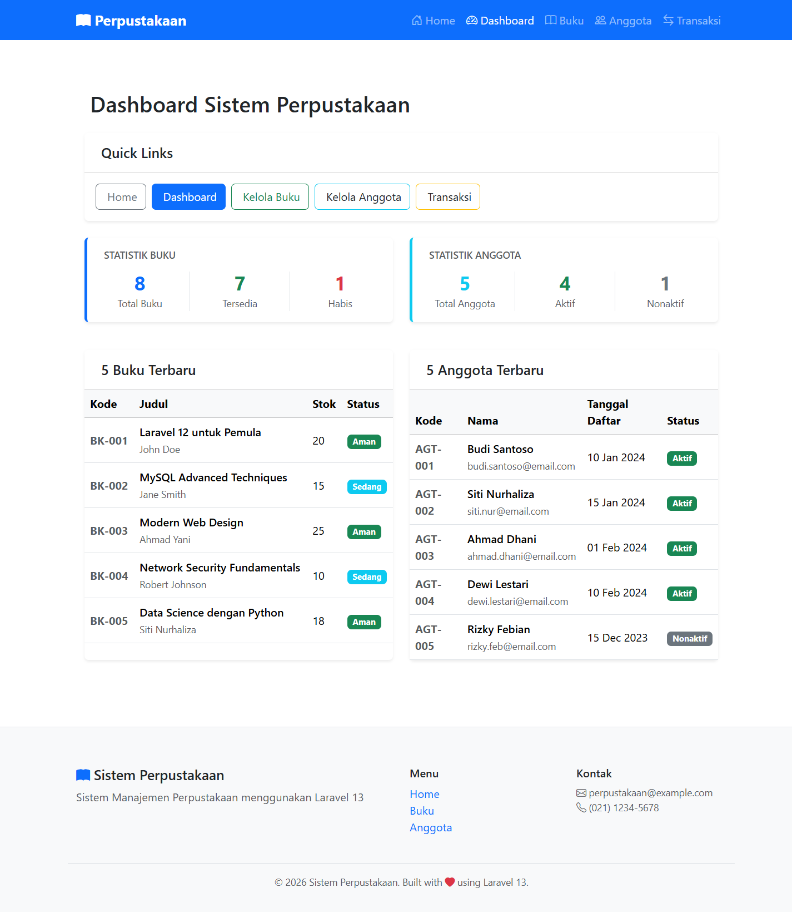
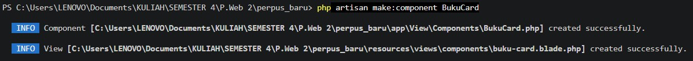
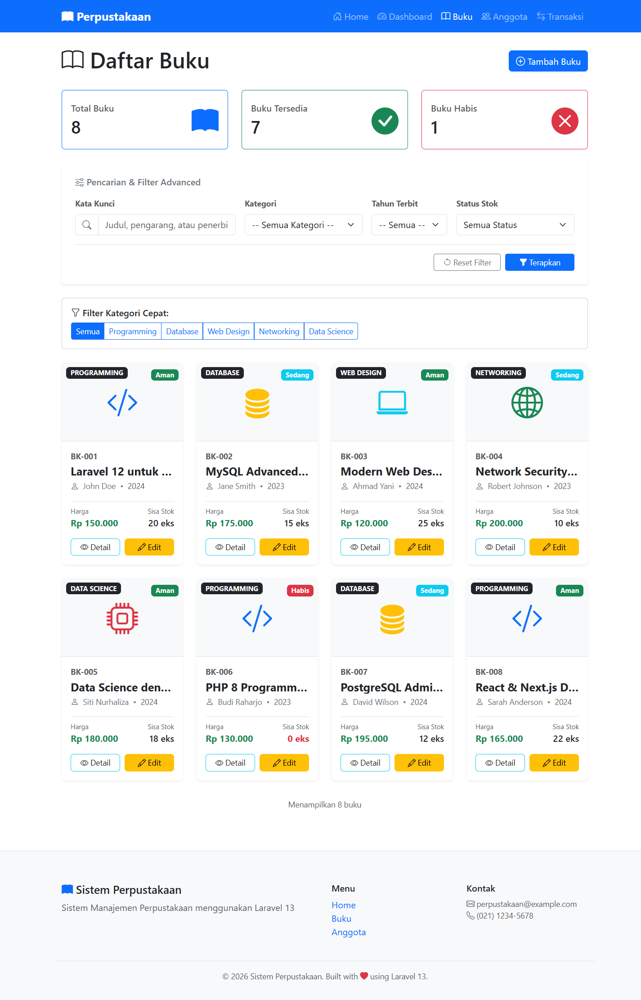

# TUGAS PEMROGRAMAN WEB 2 - PERTEMUAN 11

## Screenshot Hasil

## TUGAS 1

### Generate DashboardController

> Source: [`app/Http/Controllers/DashboardController.php`](app/Http/Controllers/DashboardController.php)  

> Source: [`resources/views/dashboard/index.blade.php`](resources/views/dashboard/index.blade.php)  

### Halaman Dashboard

## TUGAS 2

### Generate Component BukuCard

> Source: [`app/View/Components/BukuCard.php`](app/View/Components/BukuCard.php)  

> Source: [`resources/views/components/buku-card.blade.php`](resources/views/components/buku-card.blade.php)  

### Component CardBuku

## TUGAS 3

### Search dan Filter Buku Advanced
