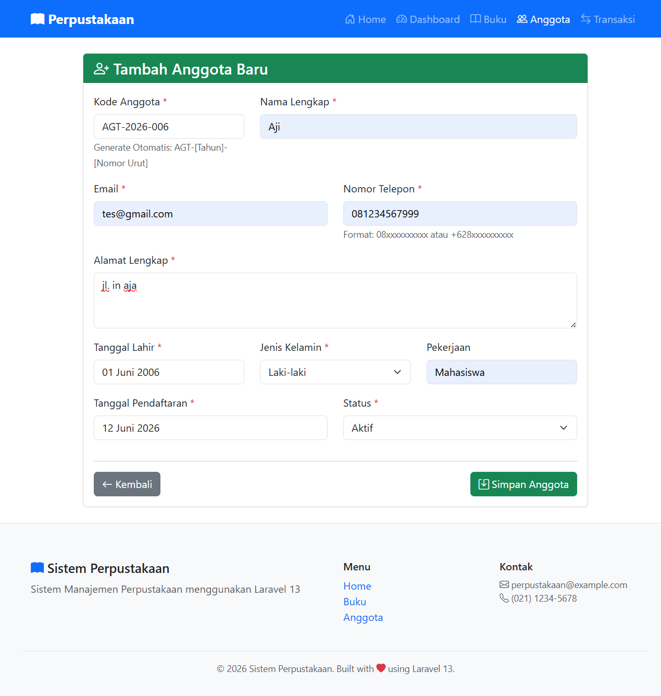
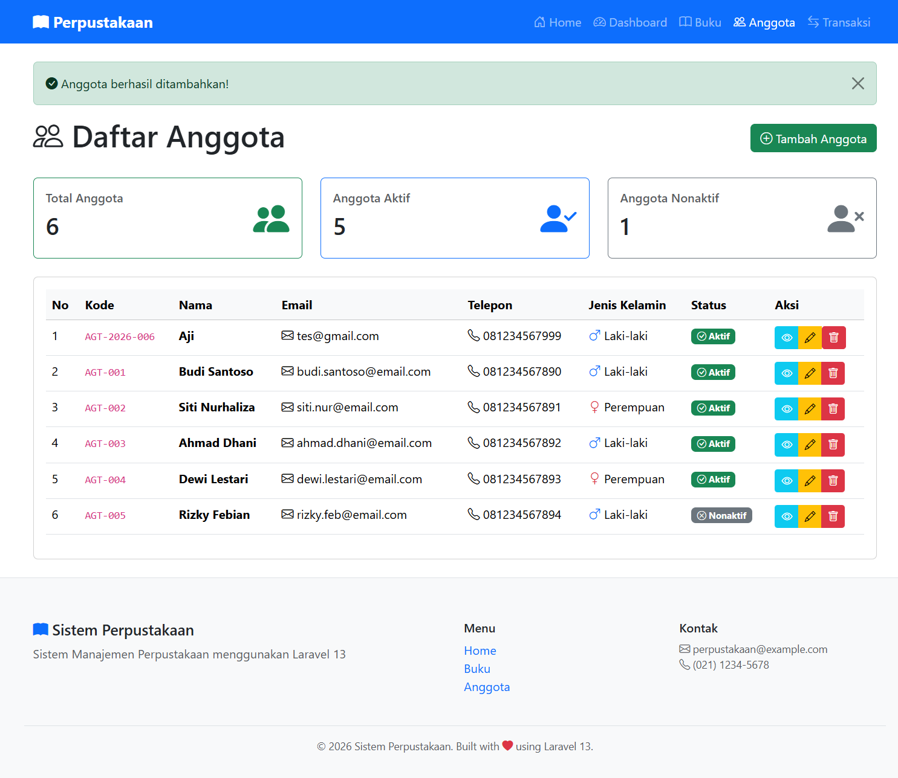
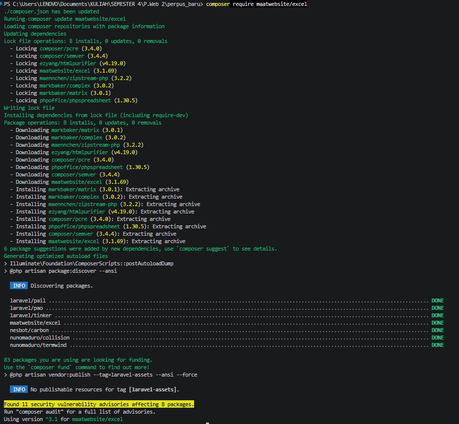
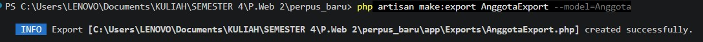
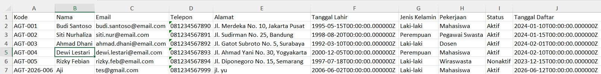
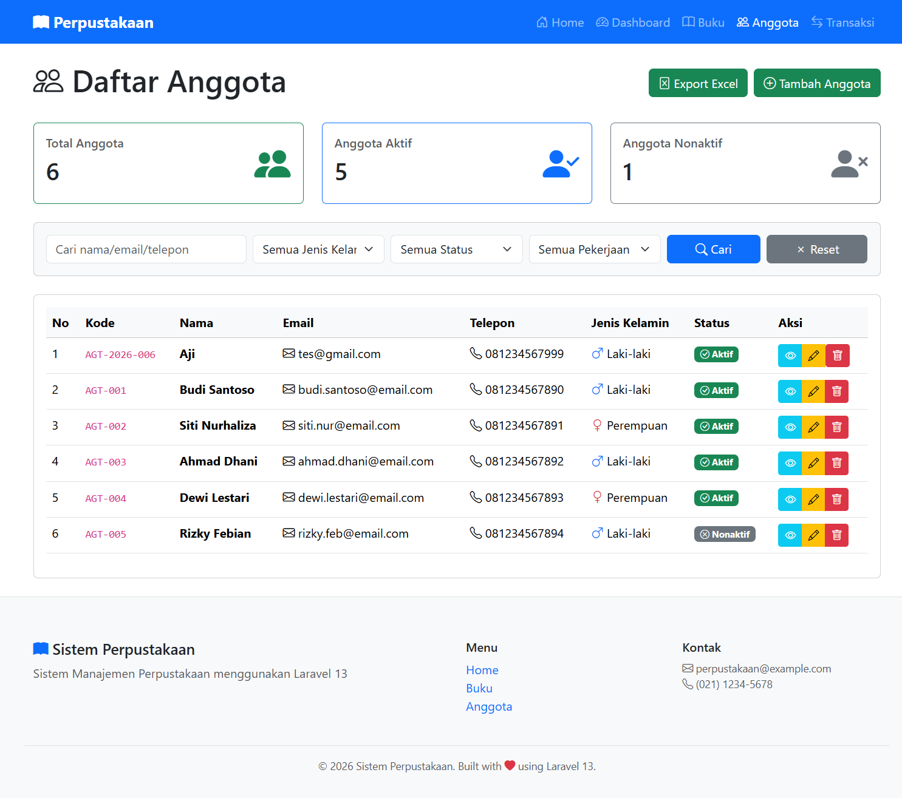

# TUGAS PEMROGRAMAN WEB 2 - PERTEMUAN 13

## Screenshot Hasil

## TUGAS 1

### Generate Kode Anggota

### Anggota Dengan Kode Baru

## TUGAS 2

### Install Package

### Export Class

### Hasil 

## TUGAS 3

### Advance Search
