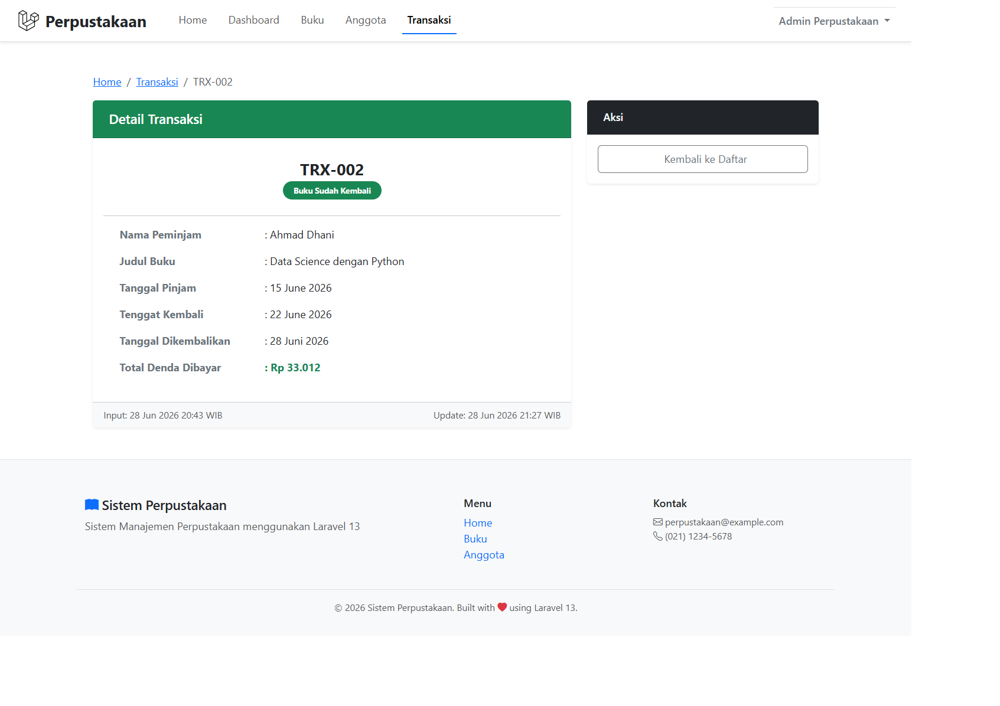
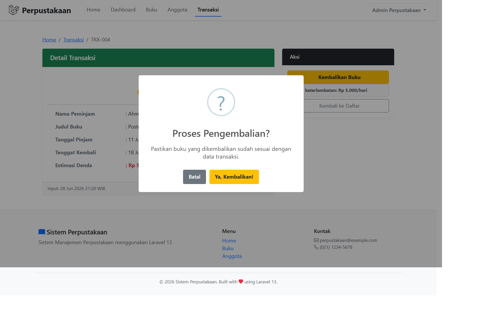
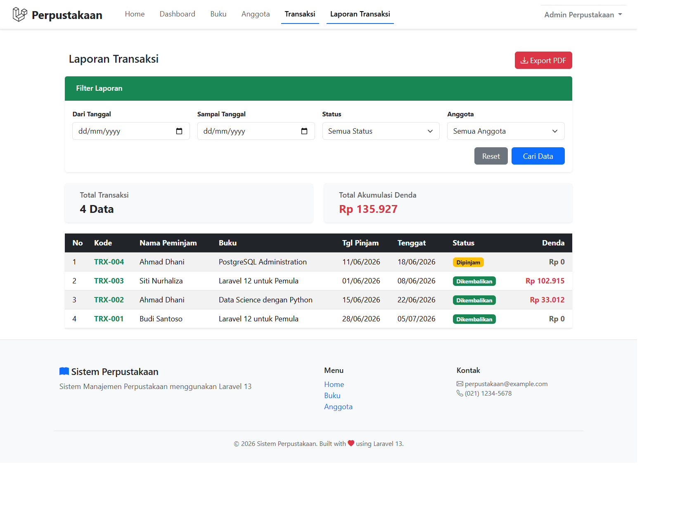
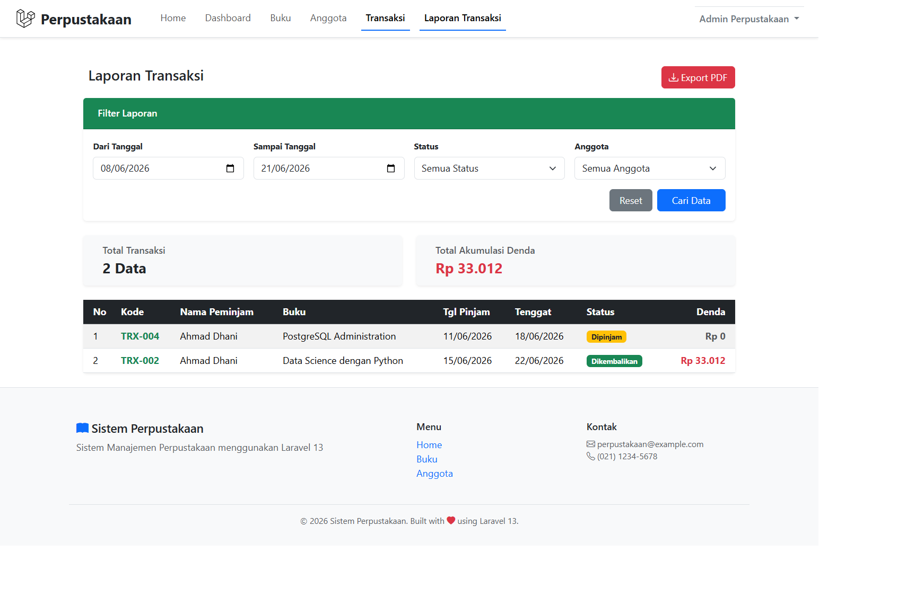
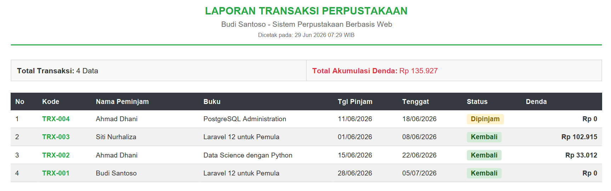
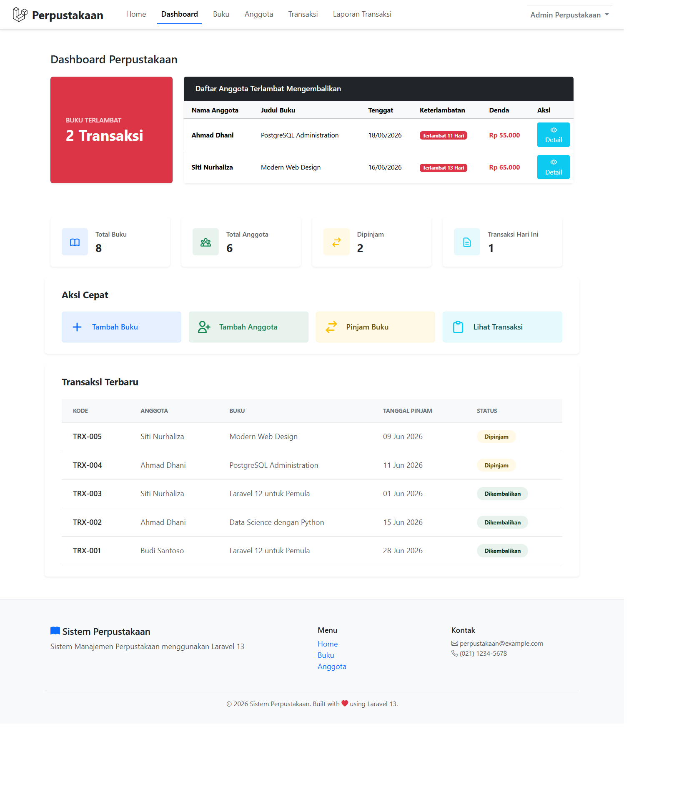
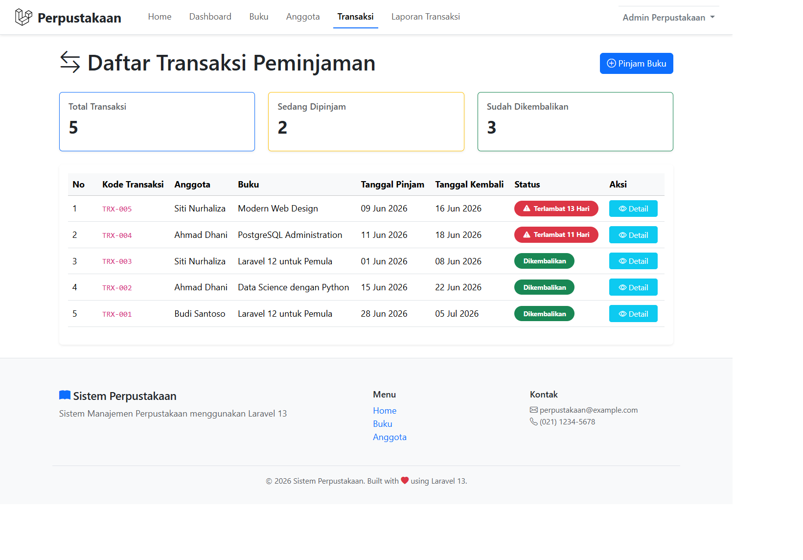
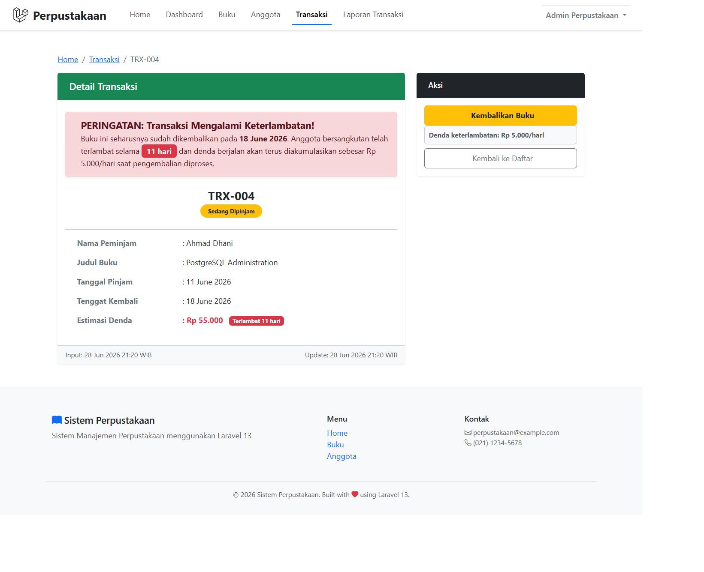

# TUGAS PEMROGRAMAN WEB 2 - PERTEMUAN 14

## Screenshot Hasil

## TUGAS 1 Fitur Pengembalian Buku

### Detail Transaksi

### SweetAlert Keembalikan Buku

### Buku Dikembalikan

## TUGAS 2 Laporan Transaksi

### Laporan Transaksi

### Filter Pencarian Laporan Transaksi

### Hasil Export PDF

## TUGAS 3 Notif Terlambat

### Widget Terlambat

### Badge Terlambat (Merah)

### Peringatan Sudah Melewati Tanggal Kembali
