# Sistem Perpustakaan Laravel

Sistem informasi perpustakaan berbasis Laravel untuk mengelola data buku, anggota, transaksi peminjaman, pengembalian, dan laporan secara digital. Aplikasi ini dikembangkan dengan pendekatan CRUD, pencarian, filter, export, serta dashboard statistik untuk memudahkan administrasi perpustakaan.

## Screenshots

### Authentication
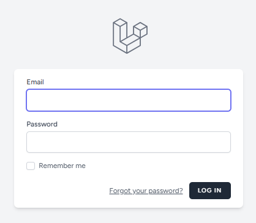
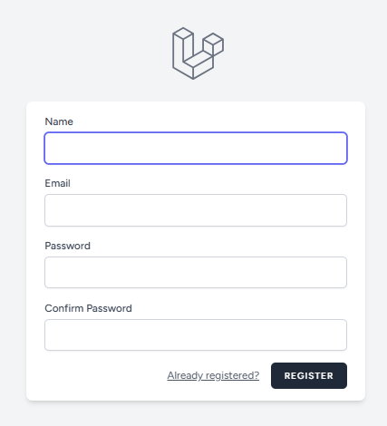

### Dashboard
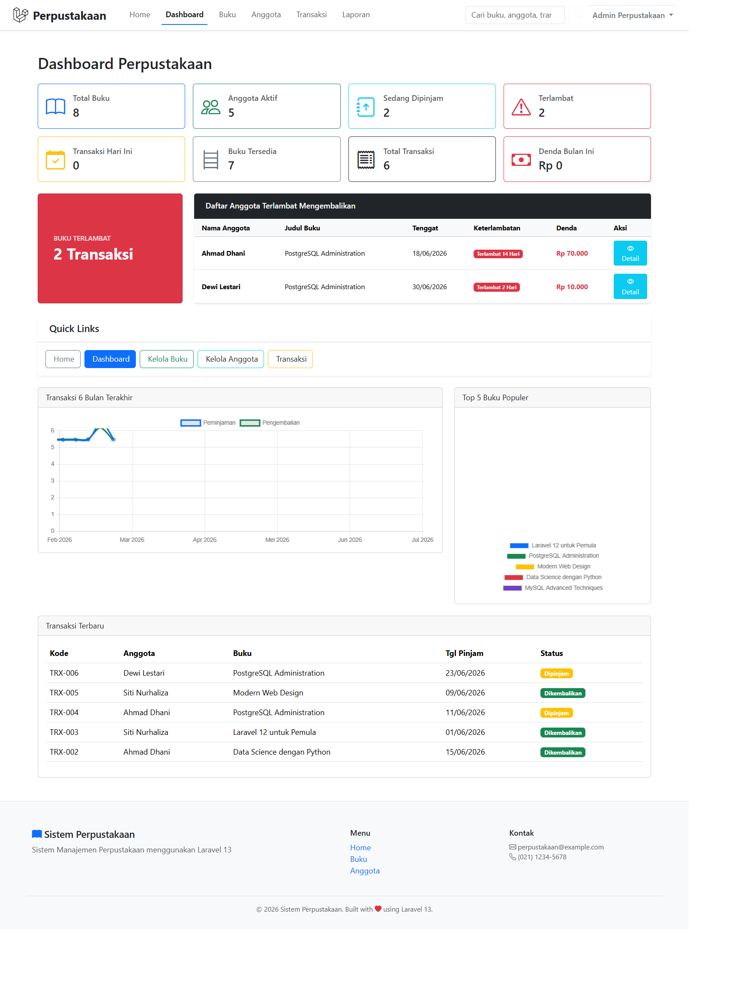

### Manajemen Buku
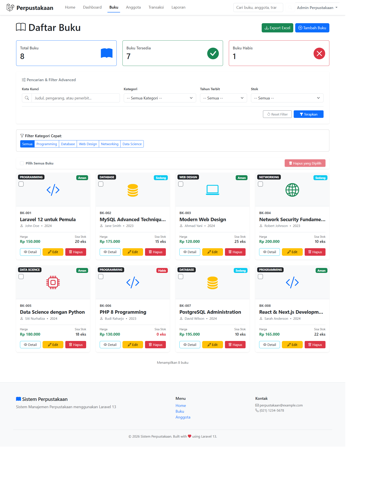
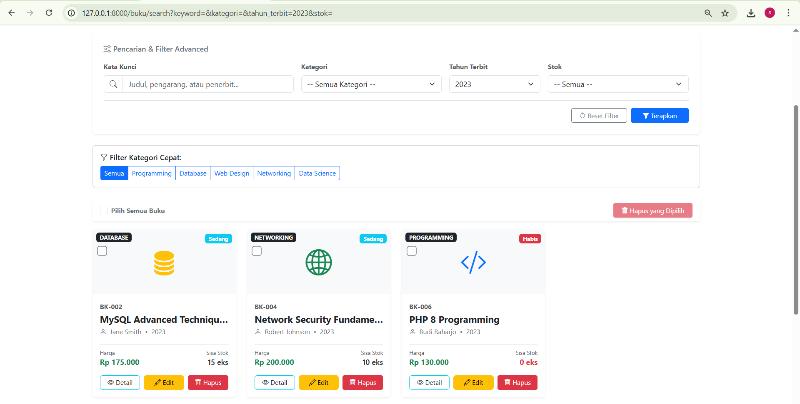
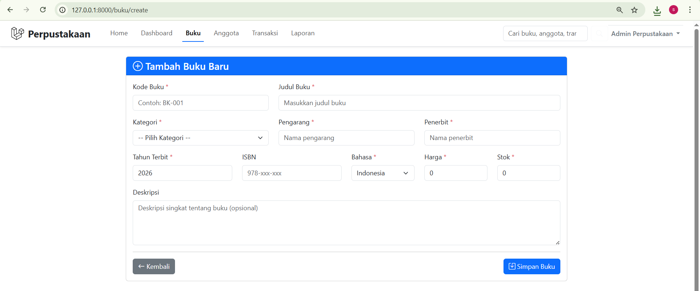
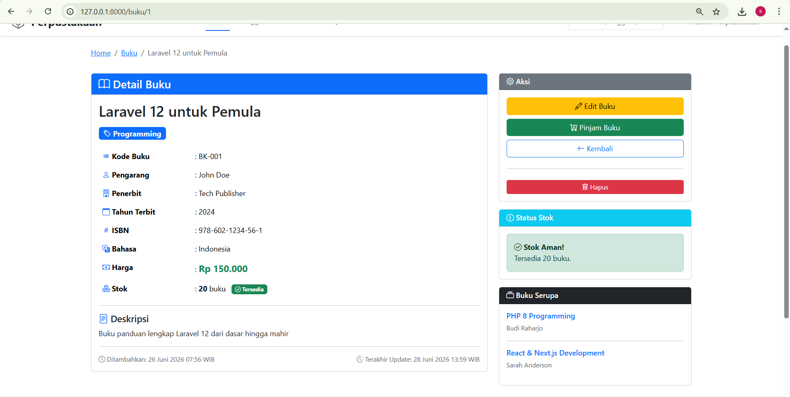

### Manajemen Anggota
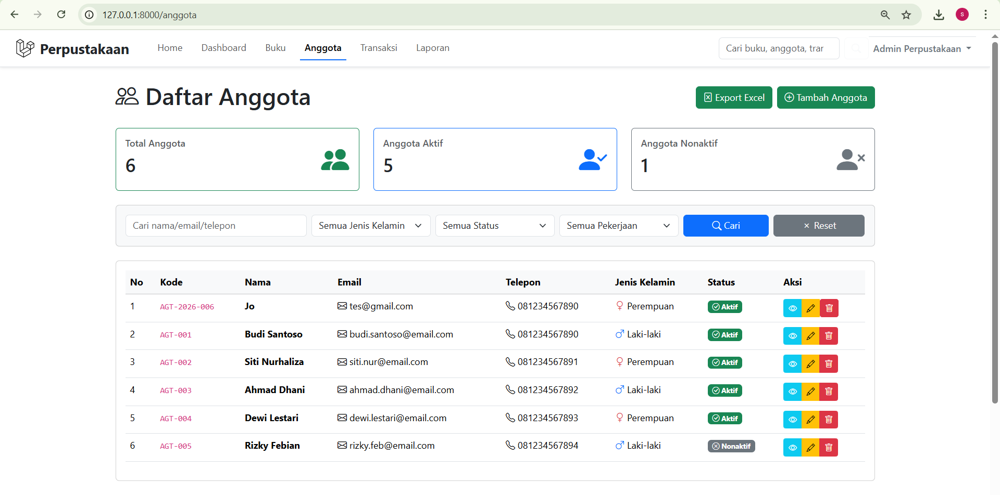
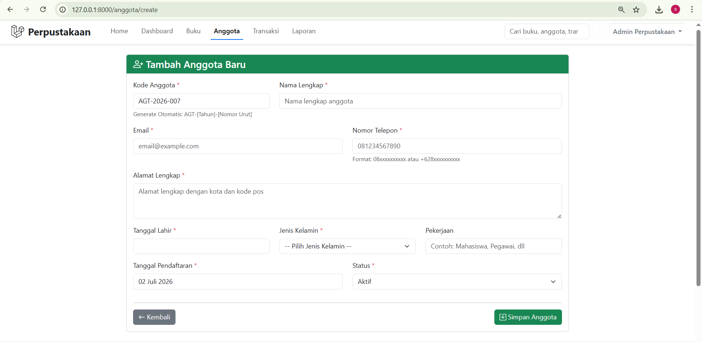
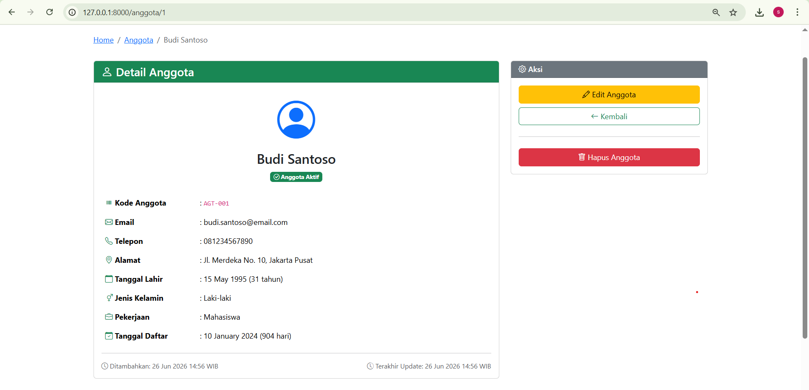

### Transaksi Peminjaman & Pengembalian
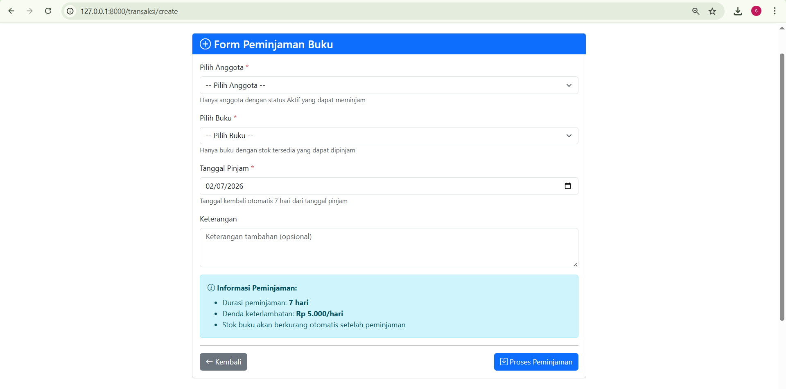
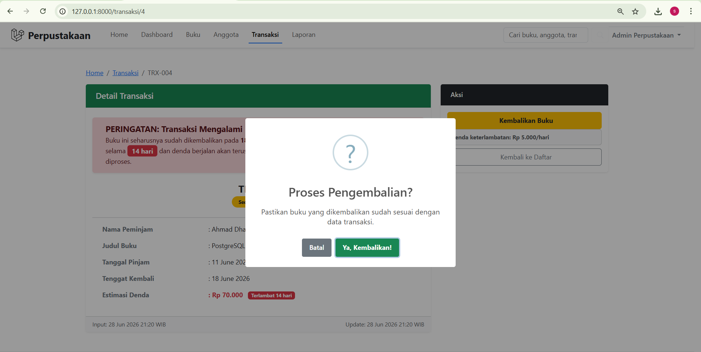
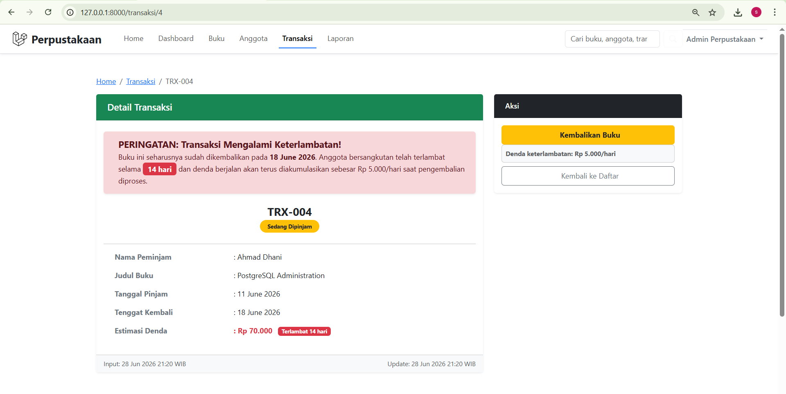
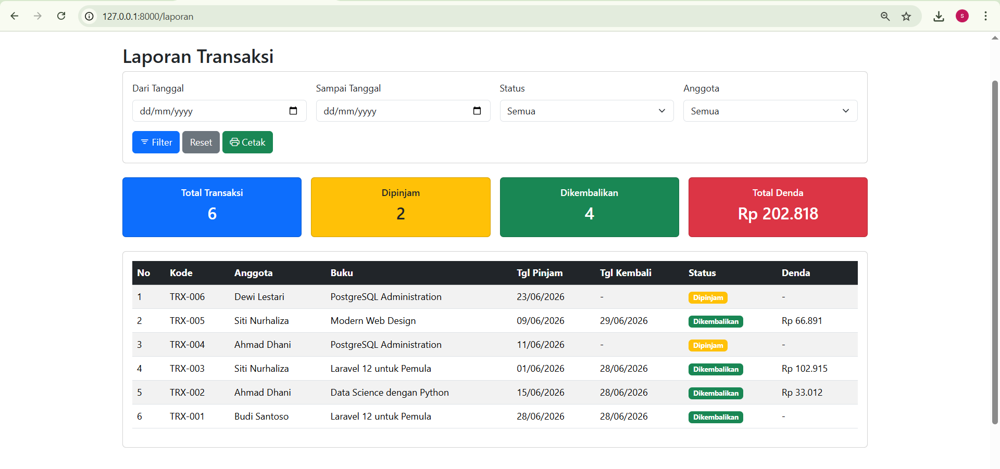

## Features

- [x] Autentikasi pengguna (login/register)
- [x] Manajemen profil pengguna
- [x] Dashboard statistik dan ringkasan data
- [x] CRUD buku
- [x] Search, filter, dan pencarian berdasarkan kategori serta stok
- [x] CRUD anggota
- [x] Search dan filter anggota
- [x] Transaksi peminjaman buku dengan pengurangan stok otomatis
- [x] Pengembalian buku dengan perhitungan denda keterlambatan
- [x] Laporan transaksi perpustakaan
- [x] Export data buku ke CSV dan anggota ke Excel
- [x] Export laporan transaksi ke PDF
- [x] Pencarian global antar data buku, anggota, dan transaksi
- [x] Indikator transaksi terlambat pada dashboard

## Installation

Berikut langkah instalasi project ini di lingkungan lokal:

1. Clone repository
   ```bash
   git clone <repository-url>
   cd perpus_baru
   ```

2. Install dependency PHP
   ```bash
   composer install
   ```

3. Salin file environment
   ```bash
   copy .env.example .env
   ```
   Jika menggunakan Linux/macOS:
   ```bash
   cp .env.example .env
   ```

4. Generate application key
   ```bash
   php artisan key:generate
   ```

5. Konfigurasi database di file `.env`
   ```env
   DB_CONNECTION=mysql
   DB_HOST=127.0.0.1
   DB_PORT=3306
   DB_DATABASE=perpustakaan
   DB_USERNAME=root
   DB_PASSWORD=
   ```

6. Jalankan migrasi dan seeder
   ```bash
   php artisan migrate --seed
   ```

7. Install dependency frontend
   ```bash
   npm install
   ```

8. Build aset frontend
   ```bash
   npm run build
   ```

9. Jalankan aplikasi
   ```bash
   php artisan serve
   ```

Setelah itu, buka browser ke `http://127.0.0.1:8000`.

## Usage

- Login menggunakan akun yang telah dibuat.
- Tambah data buku dan anggota melalui menu manajemen.
- Lakukan transaksi peminjaman untuk mengurangi stok buku.
- Proses pengembalian buku untuk menghitung denda keterlambatan.
- Akses menu laporan untuk melihat riwayat transaksi dan export ke PDF.

## Tech Stack

- PHP 8.3
- Laravel 13
- Laravel Breeze
- Blade Template
- Tailwind CSS
- Vite
- MySQL
- Composer
- DOMPDF
- Maatwebsite Excel
- PHPUnit

## Author

| **Nama Lengkap** | Satriaji Ammarulloh |
| **Nomor Induk Mahasiswa (NIM)** | 60324017 |
| **Institusi** | Universitas K.H. Abdurrahman Wahid Pekalongan |